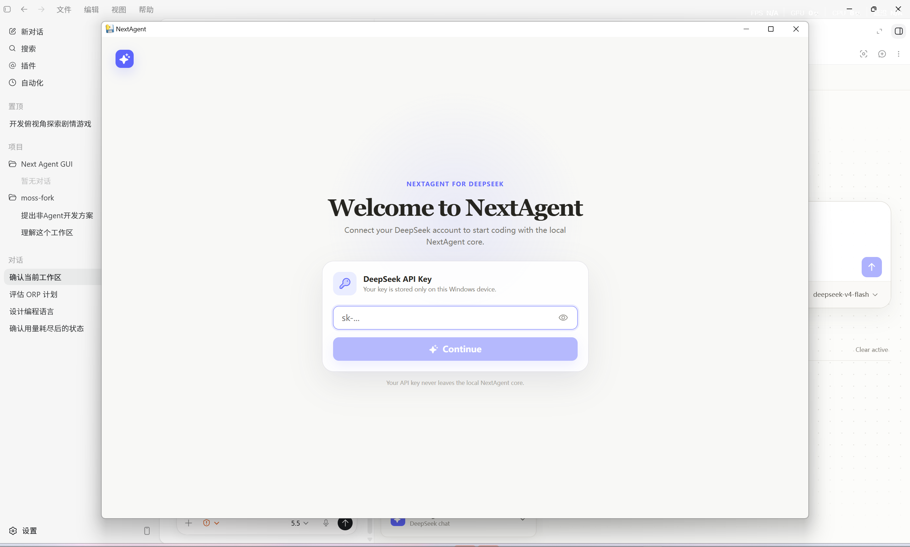
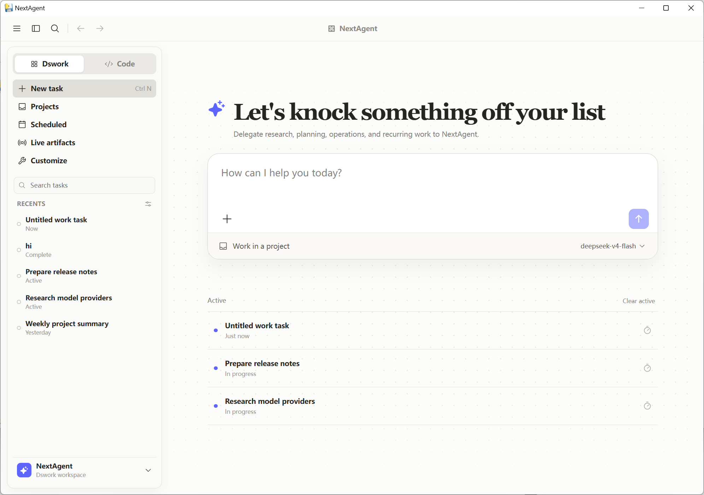
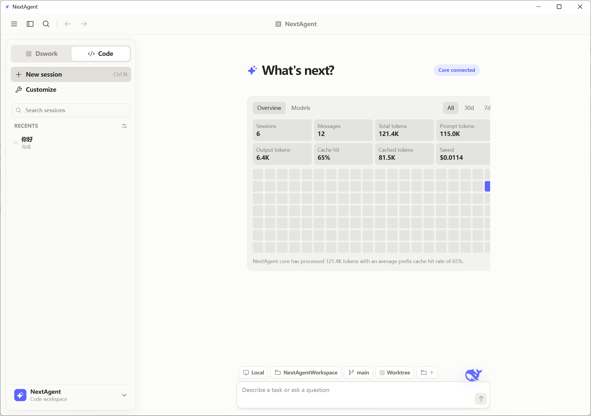
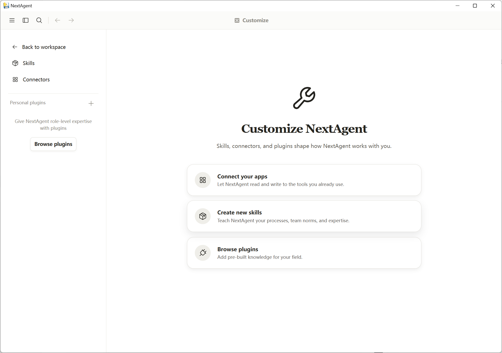

# NextAgent

NextAgent is a DeepSeek-first AI coding and work assistant. It pairs a local Python agent core with a polished desktop GUI inspired by modern coding assistants, while keeping API keys and session state on your own Windows device.

[](https://github.com/Fujo930/next-agent/releases)
[](LICENSE)
[](pyproject.toml)
[](https://www.deepseek.com/)

## Highlights

- DeepSeek V4 focused: model switching, effort control, and token/cache accounting are designed around DeepSeek usage.
- Two working modes: **Dswork** for normal conversation and task planning, **Code** for agentic coding workflows.
- Local desktop GUI: first-launch API setup, persistent sessions, recent chats, pinned items, settings, language selection, and reset flow.
- Agent memory: conversation history, user preferences, recent items, workspace state, and token billing survive restarts.
- Code workflow controls: workspace picker, branch/worktree controls, permission modes, model selector, effort slider, and stop/queue states.
- Built-in Windows packaging: single-file EXE plus NSIS installer.

## Screenshots

### First Launch



### Dswork Mode



### Code Mode



### Customize



## Download

Download the latest Windows installer from [GitHub Releases](https://github.com/Fujo930/next-agent/releases).

For release `0.2.3`, use:

- `NextAgent-Setup.exe` for normal installation.
- `NextAgent.exe` if you want the portable single-file application.

## Quick Start

### Desktop App

1. Install or run `NextAgent.exe`.
2. Enter your DeepSeek API key on first launch.
3. Pick **Dswork** for conversation or **Code** for coding tasks.

The key is stored under the current Windows user's AppData folder and is reused on the next launch.

### CLI

```bash
pip install next-agent
```

```powershell
$env:DEEPSEEK_API_KEY = "sk-..."
next-agent "explain this repository"
next-agent --model deepseek-v4-pro "design a payment system"
```

## Build From Source

```powershell
git clone https://github.com/Fujo930/next-agent
cd next-agent
uv sync --extra dev
cd NextAgentGUI
npm install
npm run build
cd ..
.\build_exe.ps1
```

The single-file EXE is written to:

```text
dist\NextAgent.exe
```

To build the Windows installer, install NSIS and run:

```powershell
makensis installer\setup.nsi
```

The installer is written to:

```text
dist\NextAgent-Setup.exe
```

## Local Development

Run the backend API and frontend dev server separately:

```powershell
next-agent-gui-api --workdir C:\Users\hooya\next-agent
cd NextAgentGUI
npm run dev
```

The GUI connects to the local core adapter and stores UI state locally.

## Configuration

| Variable | Default | Description |
| --- | --- | --- |
| `DEEPSEEK_API_KEY` | unset | DeepSeek API key |
| `NEXT_MODEL` | `deepseek-v4-flash` | Default model |
| `NEXT_WORKDIR` | `.` | Working directory |
| `NEXT_MAX_ROUNDS` | `25` | Max tool-call rounds per task |
| `NEXT_CACHE_REPORT` | `1` | Show cache hit and token stats |
| `NEXT_LANG` | `auto` | Language: `auto`, `zh`, or `en` |

## Architecture

```text
next-agent/
├─ NextAgentGUI/          React desktop interface
├─ src/next_agent/        Agent core, GUI API, tools, memory, cache stats
├─ installer/             NSIS installer script
├─ docs/                  Architecture notes and screenshots
├─ tests/                 GUI server and state tests
└─ build_exe.ps1          Windows EXE build entrypoint
```

Important core modules:

| Module | Purpose |
| --- | --- |
| `agent.py` | Main agent loop |
| `llm.py` | DeepSeek/OpenAI-compatible adapter |
| `gui_server.py` | Local GUI API and desktop bridge |
| `memory.py` | Cross-session memory |
| `cache_dash.py` | Token and prefix-cache dashboard |
| `tools/` | File, shell, git, web, patch, and registry tools |

## Project Status

`0.2.3` focuses on GUI polish, session persistence, bilingual UI support, Code/Dswork separation, real token accounting, and packaged Windows distribution.

The project is still moving quickly. Please use GitHub Issues for bugs and feature ideas.

## License

MIT
